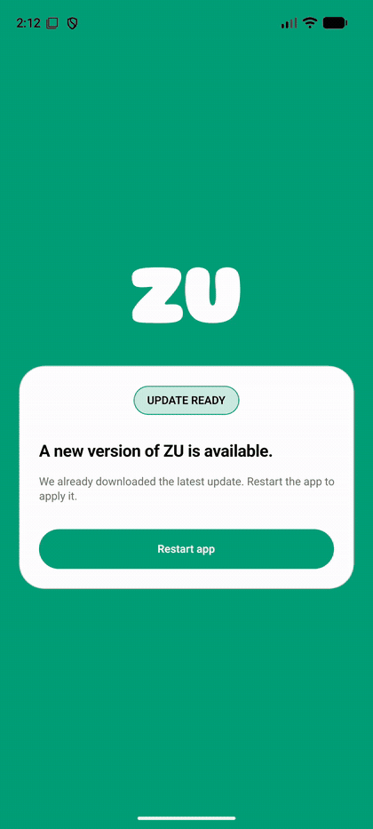
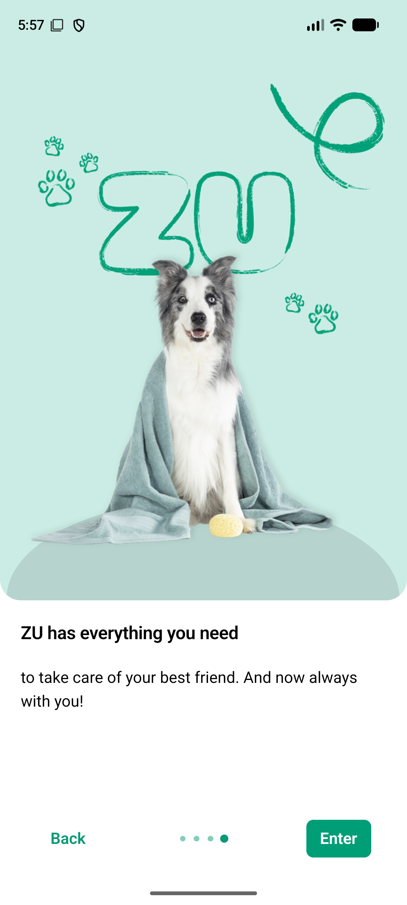

# ZU Android UI Automation



Android UI automation for the ZU app, built with Python, Appium, and pytest. Each Appium session records the emulator screen to MP4. When a test passes, the project refreshes the demo GIF and portfolio screenshot shown here.

> The GIF and portfolio screenshot are generated after a successful Appium test. Full MP4 recordings and per-session screenshots stay local in `artifacts/` and are excluded from Git.

## What the tests cover

- `test_zu_smoke.py` launches the ZU app and confirms that it is in the foreground.
   - `test_zu_home.py` handles the update prompt, moves through onboarding with the **Next** button, and checks that the app reaches the following screen.

The onboarding test pauses after each step so you can inspect or capture the screen. Run it with `-s` so pytest accepts Enter from the terminal.

## Requirements

- Windows, Python, and a project virtual environment.
- Node.js, the Appium Server, and the Appium UiAutomator2 driver.
- Android SDK Platform Tools (`adb`) and a running Android emulator.
- The ZU app installed on the emulator (`pt.continente.ZU`).
- FFmpeg on `PATH` to convert recordings to GIF. MP4 recordings are still saved without FFmpeg.

The default emulator in the capabilities is `emulator-5554`.

## Set up the Python environment

Open a PowerShell terminal in the project directory:

```powershell
py -m venv .venv
.\.venv\Scripts\Activate.ps1
python -m pip install -r requirements.txt
```

Install the UiAutomator2 driver once if it is not already installed:

```powershell
appium driver install uiautomator2
```

## Start the emulator, Appium, and the tests

1. Start the emulator in Android Studio and wait for its home screen.
2. Check the Android connection with ADB:

   ```powershell
   adb devices
   ```

   The list should include `emulator-5554` with the state `device`.

3. Open a PowerShell terminal for Appium and leave it running while the tests execute:

   ```powershell
   appium --address 127.0.0.1 --port 4723
   ```

   Confirm that Appium is listening on the port used by the tests:

   ```powershell
   Test-NetConnection 127.0.0.1 -Port 4723
   ```

   The expected result is `TcpTestSucceeded : True`.

4. In a second terminal, activate `.venv` and run both tests:

   ```powershell
   pytest -s -v tests/test_zu_smoke.py tests/test_zu_home.py
   ```

   The `-s` option lets the onboarding test receive Enter during its interactive pauses. Press Enter at each pause to advance. After the final step, the test checks that the **Next** button is gone.

To run only the quick app launch check:

```powershell
pytest -v tests/test_zu_smoke.py
```

To run without recording video:

```powershell
pytest -v --no-record-video tests/test_zu_smoke.py
```

## Recordings and the README GIF

The `appium_driver` fixture records the emulator screen for each Appium session. When the session ends, it saves:

- An MP4 recording in `artifacts/videos/`.
- A final screenshot in `artifacts/screenshots/`.
- A selected screenshot in `docs/assets/app-screen.png` when the test passes.
- A compact GIF in `docs/assets/demo.gif` when the test passes and FFmpeg is installed.

Full MP4s and per-session screenshots stay local and are ignored by Git. The GIF and selected screenshot are small portfolio previews and can be committed so they appear on GitHub.

To rebuild the GIF from the latest recording:

```powershell
python scripts/build_demo_gif.py
```

To select a recording or a specific segment:

```powershell
python scripts/build_demo_gif.py --input artifacts/videos/RECORDING_NAME.mp4 --start 5 --duration 12
```

Android screen recording is limited to three minutes per session. The onboarding test may take longer because of its manual pauses, so its MP4 can stop when it reaches that limit.

## Project structure

```text
.
├── tests/
│   ├── conftest.py          # Appium fixtures, onboarding, and artifact capture
│   ├── test_zu_smoke.py     # App launch check
│   └── test_zu_home.py      # Onboarding flow
├── scripts/
│   └── build_demo_gif.py    # Converts MP4 recordings to GIF with FFmpeg
├── artifacts/
│   ├── videos/              # Per-session MP4 recordings (local, Git-ignored)
│   └── screenshots/         # Per-session screenshots (local, Git-ignored)
├── docs/assets/
│   ├── demo.gif             # Animated preview shown at the top
│   └── app-screen.png       # Screenshot from a passing test
└── requirements.txt
```
